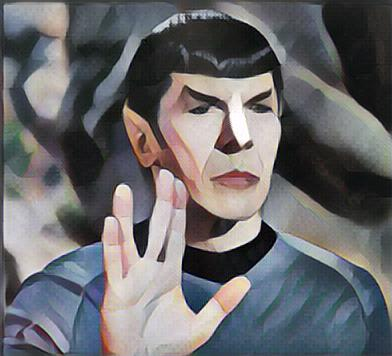
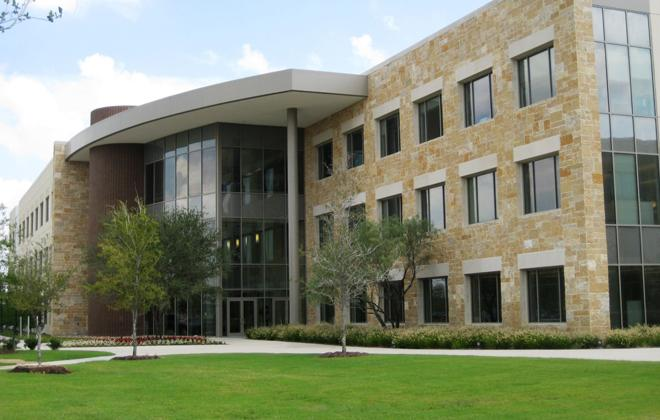

# Artificial Artist builded using deep learning and [TensorFlow](https://github.com/tensorflow/tensorflow)
_____
### Creativity
_____
Creativative is considered as an ablity only intelligent beeing possess. Google's definition of "creativity" is "the use of the imagination or original ideas, especially in the production of an artistic work." Whether artificial intelligent can be "creative" is quite a philosophical debate. Almost all great artists start with learning and imitate others work. The fast-style-transfer project is one of many examples that prove computer can at least become **an excellent apprentice**.

____
### Fast-stype-tranfer
____

This repo is forked from the [fast-style-transfer](https://github.com/lengstrom/fast-style-transfer) repo. I played with it as part of my Udacity Deep Learning Nano-degree. 

Lengstrom's AI learns the underlying techniques of a painting and apply them to other user specified picture on its own. There are pre-trained checkpoints you can download. I downloaded a couple including Francis Picabia's **Udnie**. 

[Down load udnie checkpoint](https://d17h27t6h515a5.cloudfront.net/topher/2017/January/588aa846_udnie/udnie.ckpt)

______
### Live long and prosper
______
Here is my favorite application amonst all I tried. Call me a nerd. I just love STAR TREK!!!

#### The Famous Udnie

#### The beloved Spock

#### "Live long and prosper" by Francis Picabia

_______
### Capital One
_______
As an deligent employee, I couldn't resist to try it out.

