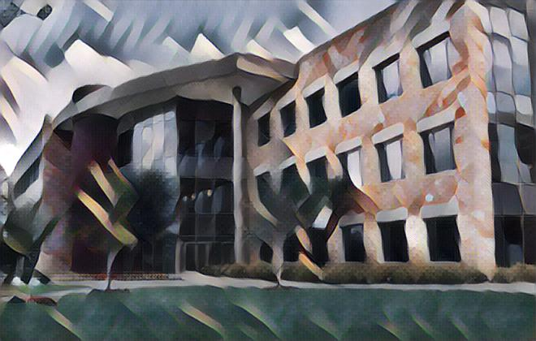
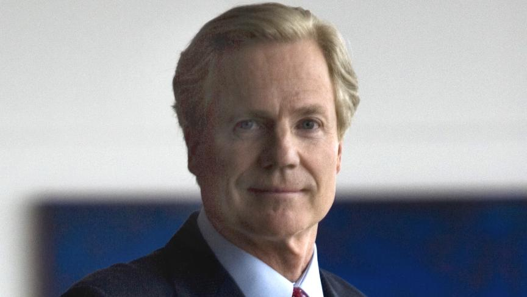
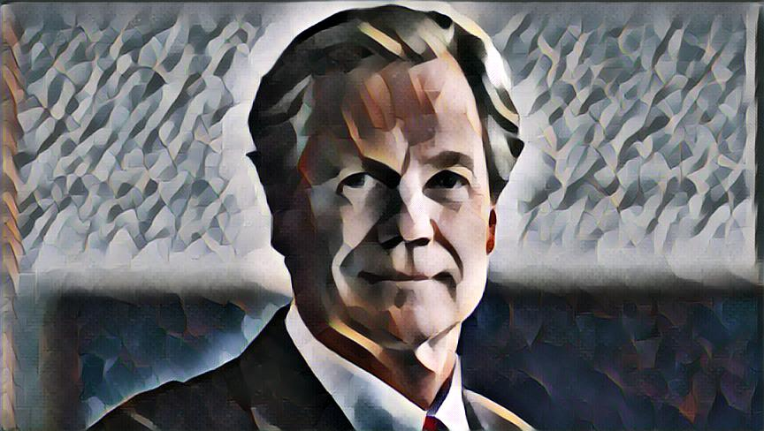
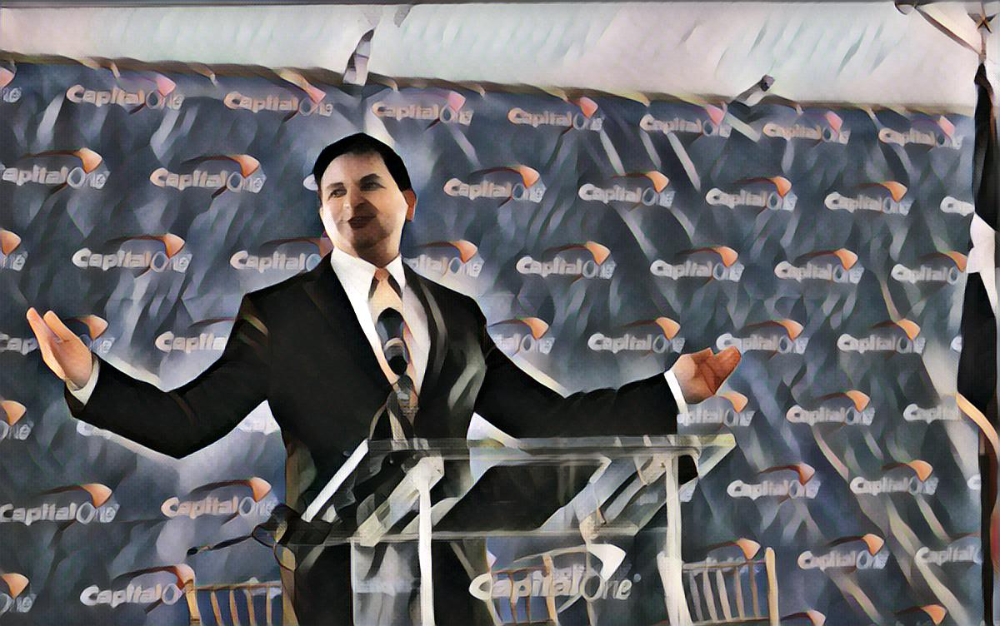

# Artificial Artist builded using deep learning and [TensorFlow](https://github.com/tensorflow/tensorflow)
_____
## Creativity
_____
Creativative is considered as an ablity only intelligent beeing possess. Google's definition of "creativity" is "the use of the imagination or original ideas, especially in the production of an artistic work." Whether artificial intelligent can be "creative" is quite a philosophical debate. Almost all great artists start with learning and imitate others work. The fast-style-transfer project is one of many examples that prove computer can at least become **an excellent apprentice**.

____
## Fast-stype-tranfer
____

This repo is forked from the [fast-style-transfer](https://github.com/lengstrom/fast-style-transfer) repo. I played with it as part of my Udacity Deep Learning Nano-degree. 

Lengstrom's AI learns the underlying techniques of a painting and apply them to other user specified picture on its own. There are pre-trained checkpoints you can download. I downloaded a couple including Francis Picabia's **Udnie**. 

[Down load udnie checkpoint](https://d17h27t6h515a5.cloudfront.net/topher/2017/January/588aa846_udnie/udnie.ckpt)

______
## Live long and prosper
______
Here is my favorite application amonst all I tried. Call me a nerd. I just love STAR TREK!!!

### The Famous Udnie
<p align = 'center'>

</p>

### The beloved Spock
<p align = 'center'>

</p>

### "Live long and prosper" by Francis Picabia

<p align = 'center'>

</p>

_______
## Capital One
_______
As an deligent employee, I couldn't resist to try it out.

### Capial One Plano Campus

<p align = 'center'>


</p>

### Rich Fairbank

<p align = 'center'>


</p>

### Sanjiv Yajnik

<p align = 'center'>


</p>

___
## How to create your own famous painting
___

### Dependencies
Better to set up virtual environment. If you have miniconda or Anaconda, you can simply use conda

```
conda create -n style-transfer python=2.7.9
source activate style-transfer
conda install -c conda-forge tensorflow=0.12.1
conda install scipy pillow
```

### Steps

1. Download the Zip archive from the fast-style-transfer repository and extract it.

2. Download the checkpoint file you want to use, and put it in the fast-style-transfer folder. (A checkpoint file is a model that already has tuned parameters. By using this checkpoint file, we won't need to train the model and can get straight to applying it.)

3. Put the image you want to style into the fast-style-transfer folder.

4. Enter the Conda environment you created above, if you aren't still in it.

5. In your terminal, navigate to the fast-style-transfer folder and enter the below command. (This is based on my setup. Please customize it to fit yours.)
```
python evaluate.py --checkpoint ./checkpoint/udnie.ckpt --in-path ./input_pics/spock2.jpg --out-path ./output_pics/udnie/spock2_udnie.jpg
```
6. **Have fun! Be aware that you may get obssessed...**


